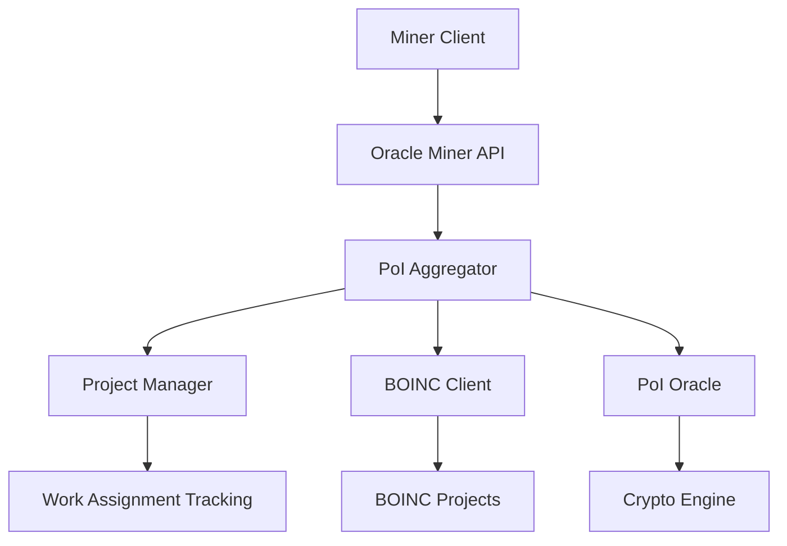

# Chert Oracle and Miner Implementation Plan

## Overview

This document outlines the implementation plan for the Chert Oracle and Miner systems. The plan covers improvements to project preference management, Oracle project management and reporting, account tracking, authentication consolidation, Miner result submission, and Oracle work allocation tracking.

## System Architecture



## 1. Project Preference Management

### Objective
Enable miners to select BOINC projects based on their hardware capabilities and preferences.

### Implementation Steps

#### 1. Project Preference Management
**Objective**: Enable miners to select BOINC projects based on their hardware capabilities and preferences.

**Detailed Implementation Steps**:

1. **Extend MinerConfig Structure**
   - Add `preferred_projects: Vec<String>` field
   - Add `hardware_capabilities: HardwareType` enum (CpuOnly, GpuOnly, Both)
   - Add `auto_select_projects: bool` option for automatic selection
   - Add `project_weights: HashMap<String, f64>` for project prioritization

2. **Implement Hardware Capability Detection**
   - Create `detect_hardware_capabilities()` function in miner client
   - Detect CPU cores, GPU availability, memory, disk space
   - Map capabilities to compatible BOINC projects

3. **Enhance Oracle Project Matching**
   - Extend `ProjectConfig` with `hardware_requirements: HardwareType`
   - Implement `check_project_compatibility()` method
   - Add project scoring algorithm based on:
     - Hardware compatibility
     - Miner preferences
     - Project priority
     - Current workload balance

4. **Create Miner Preference API Endpoints**
   - `GET /miner/preferences` - Get current preferences
   - `POST /miner/preferences` - Update preferences
   - `GET /miner/compatible-projects` - Get compatible projects
   - `POST /miner/select-project` - Manual project selection

5. **Implement Preference Storage**
   - Add preference persistence to miner configuration
   - Create preference validation and migration utilities
   - Add default preference templates for new users

#### 2. Oracle Project Management and Reporting
**Objective**: Create a robust system for managing multiple BOINC projects and providing reporting for miners.

**Detailed Implementation Steps**:

1. **Enhanced ProjectManager Structure**
   - Add `project_health_monitoring: HashMap<String, ProjectHealth>`
   - Add `work_distribution_stats: WorkDistributionStats`
   - Add `miner_performance_metrics: HashMap<String, MinerMetrics>`
   - Implement `project_load_balancing()` method

2. **Project Health Monitoring**
   - Monitor project availability and response times
   - Track success/failure rates for each project
   - Implement automatic project disabling on health issues
   - Add health check endpoints to web API

3. **Advanced Reporting System**
   - Create `ProjectReport` struct with comprehensive metrics
   - Implement `generate_project_report()` method
   - Add real-time project statistics dashboard
   - Create historical performance tracking
   - Implement project comparison tools

4. **Resource Management**
   - Implement dynamic resource allocation based on project demand
   - Add project priority adjustment algorithms
   - Create resource usage optimization
   - Add capacity planning and forecasting

#### 3. Account Tracking Mechanism
**Objective**: Properly track accounts vs work units to prevent duplication and ensure accurate accounting.

**Detailed Implementation Steps**:

1. **Enhanced Work Assignment Tracking**
   - Add `global_assignment_registry: HashMap<String, WorkAssignment>`
   - Implement `assignment_deduplication()` method
   - Add cross-node assignment synchronization
   - Create assignment conflict resolution

2. **Account-to-Work Mapping System**
   - Implement `AccountWorkRegistry` with unique identifiers
   - Add `work_unit_lifecycle_tracking()` from creation to completion
   - Create `account_work_history()` for audit trails
   - Implement `work_unit_transfer()` for account changes

3. **Duplicate Prevention Mechanisms**
   - Add `work_unit_fingerprinting()` using cryptographic hashes
   - Implement `duplicate_detection_across_nodes()` method
   - Add `assignment_conflict_resolution()` system
   - Create `work_unit_locking()` during critical operations

#### 4. Authentication/Setup Consolidation
**Objective**: Consolidate authentication and setup into environment variables for IDs/usernames and config files for project details.

**Detailed Implementation Steps**:

1. **Secure Configuration Management**
   - Move all authenticators to environment variables:
     - `CHERT_BOINC_MILKYWAY_AUTHENTICATOR`
     - `CHERT_BOINC_ROSETTA_AUTHENTICATOR`
     - `CHERT_BOINC_WCG_AUTHENTICATOR`
     - `CHERT_BOINC_GPUGRID_AUTHENTICATOR`
   - Keep project details in configuration files:
     - Project URLs, endpoints, requirements
     - Credit multipliers, minimum CPU times
   - Implement `SecureConfigLoader` with validation
   - Add configuration templates and examples

2. **Enhanced Security Validation**
   - Implement `validate_secure_configuration()` method
   - Add `sanitize_sensitive_data()` utility functions
   - Create `security_audit_log()` for compliance
   - Implement `credential_rotation()` mechanism

#### 5. Miner Result Submission
**Objective**: Create a secure and reliable mechanism for miners to submit completed work results.

**Detailed Implementation Steps**:

1. **Enhanced Submission Pipeline**
   - Implement `WorkResultProcessor` with validation stages
   - Add `result_verification_queue()` for batch processing
   - Create `submission_retry_logic()` with exponential backoff
   - Implement `result_aggregation()` for multiple work units

2. **Advanced Validation System**
   - Add `work_integrity_verification()` method
   - Implement `result_consistency_check()` across nodes
   - Create `fraud_detection_mechanism()` system
   - Add `performance_benchmarking()` for submitted work

3. **Cryptographic Receipt System**
   - Enhance `WorkReceipt` with detailed metadata
   - Implement `receipt_verification_chain()` method
   - Add `receipt_storage_and_backup()` system
   - Create `receipt_audit_trail()` for compliance

#### 6. Oracle Work Allocation Tracking
**Objective**: Ensure work allocation tracking prevents duplicate task sending to various locations including GPOD.

**Detailed Implementation Steps**:

1. **Global Assignment Registry**
   - Implement `GlobalWorkRegistry` with distributed locking
   - Add `assignment_uniqueness_validation()` method
   - Create `cross_oracle_synchronization()` mechanism
   - Implement `assignment_replication()` for fault tolerance

2. **GPOD Integration**
   - Integrate with silica GPOD system for geographic diversity
   - Implement `location_based_assignment()` method
   - Add `network_topology_awareness()` for distribution
   - Create `diversity_metrics_tracking()` system

3. **Advanced Deduplication**
   - Implement `work_unit_fingerprinting()` across all nodes
   - Add `real_time_duplicate_detection()` system
   - Create `assignment_conflict_resolution()` mechanism
   - Implement `load_balancing_with_history()` method

#### 7. Integration Points
**Miner to Oracle Communication**:
- Enhanced `/miner/job` endpoint with preference-aware work distribution
- Improved `/miner/submit` with batch submission and validation
- New `/miner/preferences` endpoints for preference management
- Enhanced `/miner/status` with detailed work history
- `/miner/compatible-projects` for capability-based project discovery

**Oracle Internal Components**:
- Enhanced ProjectManager with health monitoring and load balancing
- Improved PoIServiceAggregator with intelligent caching
- Strengthened CryptoEngine with advanced receipt signing
- Enhanced BoincClient with better error handling and retry logic

**Security and Performance**:
- All communications use HTTPS with certificate validation
- Comprehensive input validation and sanitization
- Rate limiting and DDoS protection
- Performance monitoring and alerting
- Comprehensive audit logging

#### 8. Implementation Priority
1. **Authentication/setup consolidation** (security critical)
2. **Account tracking mechanism** (prevents resource waste)
3. **Project preference management** (improves miner experience)
4. **Oracle project management enhancements** (better resource utilization)
5. **Miner result submission improvements** (completes workflow)
6. **Work allocation tracking** (prevents duplication)
7. **Reporting and monitoring features** (operational visibility)

#### 9. Testing and Deployment
- Comprehensive unit tests for all new components
- Integration tests for miner/oracle communication
- Security tests for authentication mechanisms
- Load testing for work distribution algorithms
- End-to-end testing with real BOINC projects
- Configuration validation and migration testing
- Performance benchmarking and optimization
- Security penetration testing
- Canary deployments and gradual rollouts
- Monitoring and alerting setup
- Documentation and training materials

#### 10. Configuration Examples
```toml
# Example miner configuration with preferences
[miner]
oracle_url = "https://oracle.chert.network"
user_id = "chert_miner_001"
hardware_capabilities = "Both"  # Auto-detect
preferred_projects = ["MilkyWay@Home", "Rosetta@Home"]
auto_select_projects = true
project_weights = { "MilkyWay@Home" = 1.2, "Rosetta@Home" = 1.0 }

# Example Oracle project configuration
[projects.milkyway]
name = "MilkyWay@Home"
scheduler_url = "https://milkyway.cs.rpi.edu/milkyway_cgi/cgi"
master_url = "https://milkyway.cs.rpi.edu/milkyway/"
hardware_requirements = "Both"  # Supports CPU and GPU
credit_multiplier = 1.2
min_cpu_time = 600.0
priority = 1
enabled = true

[projects.rosetta]
name = "Rosetta@Home"
scheduler_url = "https://boinc.bakerlab.org/rosetta/cgi-bin/cgi"
master_url = "https://boinc.bakerlab.org/rosetta/"
hardware_requirements = "Both"
credit_multiplier = 1.0
min_cpu_time = 1800.0
priority = 2
enabled = true
```

#### Environment Variables Required
```bash
# Authentication (sensitive - never in config files)
export CHERT_BOINC_MILKYWAY_AUTHENTICATOR="your_authenticator_here"
export CHERT_BOINC_ROSETTA_AUTHENTICATOR="your_authenticator_here"
export CHERT_BOINC_WCG_AUTHENTICATOR="your_authenticator_here"
export CHERT_BOINC_GPUGRID_AUTHENTICATOR="your_authenticator_here"

# Oracle configuration
export CHERT_ORACLE_API_KEY="your_oracle_api_key_here"
export CHERT_ORACLE_HOST="0.0.0.0"
export CHERT_ORACLE_PORT="8765"
```

## 2. Oracle Project Management and Reporting

### Objective
Create a robust system for managing multiple BOINC projects and providing reporting for miners.

### Implementation Steps
- Enhance ProjectManager with project statistics tracking
- Implement project reporting APIs
- Add project priority management
- Create web dashboard for project monitoring

### Key Components
- Project registration and configuration
- Work assignment with priority handling
- Credit limit enforcement
- Project statistics aggregation

## 3. Account Tracking Mechanism

### Objective
Properly track accounts vs work units to prevent duplication and ensure accurate accounting.

### Implementation Steps
- Implement unique work ID generation
- Add work assignment tracking in ProjectManager
- Create account-to-work mapping
- Implement duplicate detection mechanisms

### Data Structures
- WorkAssignment with status tracking
- Account-to-work mapping cache
- Daily credit usage tracking

## 4. Authentication/Setup Consolidation

### Objective
Consolidate authentication and setup into environment variables for IDs/usernames and config files for project details.

### Implementation Steps
- Modify config loading to use environment variables for sensitive data
- Update configuration files to exclude sensitive information
- Implement secure configuration validation
- Add configuration examples and documentation

### Security Considerations
- All authenticators must come from environment variables
- Configuration files should only contain non-sensitive project details
- Implement proper logging sanitization for sensitive data

## 5. Miner Result Submission

### Objective
Create a secure and reliable mechanism for miners to submit completed work results.

### Implementation Steps
- Enhance miner_api endpoints for result submission
- Implement result validation in Oracle
- Add cryptographic signing of work receipts
- Create receipt verification mechanism

### Key Features
- Secure result transmission
- Work receipt generation and signing
- Result validation before acceptance
- Error handling and reporting

## 6. Oracle Work Allocation Tracking

### Objective
Ensure work allocation tracking prevents duplicate task sending to various locations including GPOD.

### Implementation Steps
- Implement global work assignment tracking
- Add deduplication mechanisms
- Create work distribution algorithms
- Implement GPOD integration for diverse work distribution

### Tracking Mechanisms
- Centralized work assignment registry
- Real-time allocation updates
- Cross-node synchronization
- Duplicate detection and prevention

## Integration Points

### Miner to Oracle Communication
- `/miner/job` - Get work for miner
- `/miner/submit` - Submit completed work
- `/miner/status` - Get miner status

### Oracle Internal Components
- ProjectManager - Handles project configurations and work assignments
- PoIServiceAggregator - Manages work caching and PoI proof generation
- CryptoEngine - Handles cryptographic operations and receipt signing
- BoincClient - Interfaces with real BOINC projects

## Implementation Priority

1. Authentication/setup consolidation (security critical)
2. Account tracking mechanism (prevents resource waste)
3. Project preference management (improves miner experience)
4. Oracle project management enhancements (better resource utilization)
5. Miner result submission improvements (completes the workflow)
6. Work allocation tracking (prevents duplication)
7. Reporting and monitoring features (operational visibility)

## Testing Considerations

- Unit tests for all new components
- Integration tests for miner/oracle communication
- Security tests for authentication mechanisms
- Load testing for work distribution algorithms
- End-to-end testing with real BOINC projects

## Deployment Steps

1. Update configuration management
2. Implement account tracking
3. Enhance project management
4. Improve miner communication
5. Add work allocation tracking
6. Implement reporting features
7. Conduct comprehensive testing
8. Document all changes
9. Deploy to testnet
10. Monitor and validate